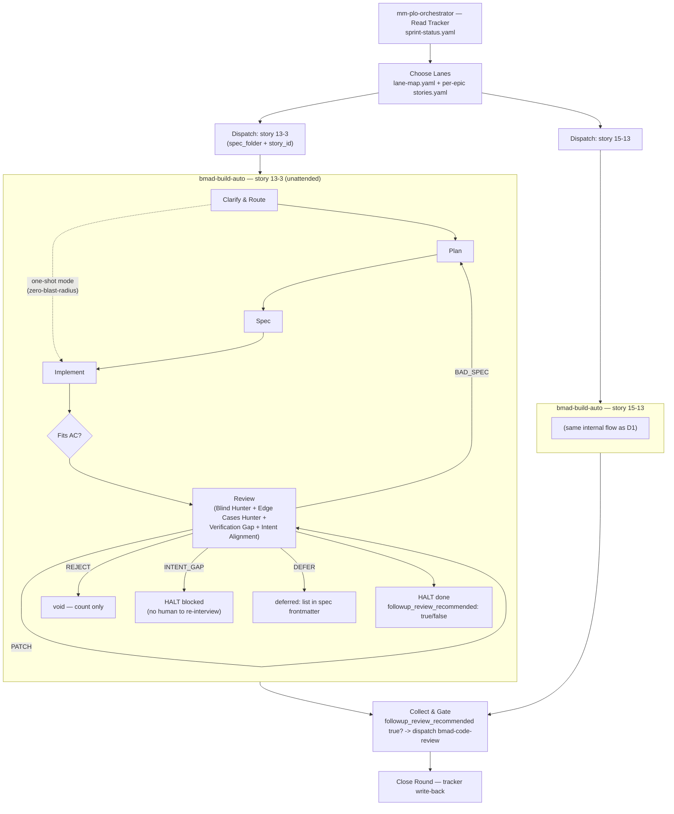

# How mm-plo-orchestrator relates to bmad-build

BMad 6.11.0 changed the implementation phase significantly: `bmad-dev-story`,
`bmad-quick-dev`, and `bmad-create-story` are now deprecated shims, and the
canonical entry points are `bmad-build` (interactive) and `bmad-build-auto`
(unattended). Both now run an adversarial review — Blind Hunter, Edge Case
Hunter, Verification Gap Reviewer, plus a fourth lens — inline, as part of a
single invocation, where that used to require separate dev / QA / code-review
handoffs. This doc records what that changed for `mm-plo-orchestrator`, and
what didn't.

## Is the orchestrator still needed?

Yes. `bmad-build-auto`'s own routing step is explicit about its own scope:

> One `stories.yaml` entry per invocation: never read another entry, and
> never advance to a different story id regardless of outcome.

It has no concept of a tracker, a round, multiple lanes, dependency ordering
between stories, or epic-level bookkeeping — one story, start to finish, per
invocation, and internally strictly sequential (route → plan → implement →
review, in that order). Everything `mm-plo-orchestrator` does — read the
tracker, pick which stories are ready this round, respect the lane map's
dependencies, fan out multiple stories concurrently, gate the round, write
back — sits one layer above that and doesn't exist anywhere upstream in
BMad. The orchestrator is the layer that makes multiple `bmad-build-auto`
invocations behave like a sprint round; `bmad-build-auto` supplies the
parallelism-free execution unit those lanes dispatch to.

**Design principle:** the orchestrator is a thin wrapper around upstream
BMad skills, not a reimplementation of their internals. It reads what they
already decide (tracker status, `stories.yaml` fields, `followup_review_
recommended`) and dispatches accordingly — it never re-derives review
verdicts, checkpoint logic, or spec content itself. That's what lets it keep
working as `bmad-build`/`bmad-build-auto` evolve upstream, without a matching
edit here every time.

## The flow

This is drawn from the actual installed skill sources
(`.claude/skills/bmad-build-auto/step-01..04-*.md`) and the official
[BMad Build diagram](https://docs.bmad-method.org/diagrams/build-diagram.png),
adapted for the unattended variant: `bmad-build` (interactive) loops
`INTENT_GAP` back to re-interview a human at "Clarify and Route"; `bmad-build-
auto` has no human to interview, so it HALTs `blocked` at that same branch
instead — same failure category, different terminal behavior.

## Where specs live

- **Per epic:** `{spec_folder}/stories.yaml` (index — `id`, `title`,
  `description`, plus the caller-facing dispatch fields below) and
  `{spec_folder}/stories/{story_id}-{slug}.md` (the per-story spec).
  `{spec_folder}` is the epic's own folder, sibling to that epic's
  `SPEC.md` — owned by `bmad-spec`/Story Breakdown, not derived by this
  orchestrator. The tracker/lane map is expected to already know which
  `spec_folder` a given story belongs to.
- **Ad hoc / no tracker story:** `{implementation_artifacts}/spec-{slug}.md`
  (`{implementation_artifacts}` defaults to
  `_bmad-output/implementation-artifacts`).

`stories.yaml` defines three fields specifically for whichever tool
dispatches the stories — this orchestrator reads and respects them rather
than deciding checkpoint behavior itself:

| Field | Meaning |
|---|---|
| `spec_checkpoint` | Pause for human review once planning produces the spec, before implementation starts. |
| `done_checkpoint` | Pause after the story completes, before dispatching anything further. |
| `invoke_dev_with` | Free-text dispatch guidance, appended verbatim to the dev skill's prompt — not spec content. |

## Review, triage, and `bmad-code-review`

`bmad-build-auto`'s review step triages every finding into one of five
buckets — `intent_gap`, `bad_spec`, `patch`, `defer`, `reject` — and appends
counts for all five to the spec's `## Review Triage Log` on every pass.
Content survives differently per bucket: `defer` findings keep full text in
the spec's `deferred:` frontmatter list; `reject` findings are dropped after
being counted — by design, "noise." (The official diagram also shows a
`deferred_work.md` file; the installed `step-04-review.md` writes defers into
the spec's own frontmatter instead. Unreconciled — flagging rather than
guessing at which is current.)

`bmad-code-review` is a fourth, separate skill reusing the identical
review-layer engine, invocable standalone on any diff. It is **not** a step
inside `bmad-build`/`bmad-build-auto` — for a story that already went
through `bmad-build-auto`, the review already happened. `mm-plo-orchestrator`
only dispatches `bmad-code-review` when that story's `followup_review_
recommended` came back `true`, never as a default second lane per story.

**Known cost note, not something this orchestrator can tune:**
`step-04-review.md` requires *"All review subagents must run at the same
model capability as the current session"* — cheaper-model review isn't an
available lever without editing `bmad-build-auto`'s own `customize.toml`,
which would break the "don't touch upstream internals" principle above.
