```mermaid
gantt
    title Round 1 — stories 1-4, pipelined not sequential
    dateFormat  X
    axisFormat  %L
    section Story 1
    Dev      :s1d, 0, 2
    Review   :s1r, after s1d, 1
    QA       :s1q, after s1r, 1
    section Story 2
    Dev      :s2d, 0, 2
    Review   :s2r, after s2d, 1
    section Story 3
    Dev      :s3d, 1, 2
    Review   :s3r, after s3d, 1
    section Story 4
    Dev      :s4d, 2, 2
```

# Tutorial: Running Your First Sprint Round

This walks through installing `mm-plo-addon` and running a real sprint round end to end: three terminals, stories advancing in parallel, and the human decisions in between.

**Who this is for:** you already know BMad Method basics — John (`bmad-agent-pm`), Amelia (`bmad-agent-dev`), Sally (`bmad-agent-ux-designer`), epics and stories. This tutorial covers specifically how the two skills in this addon — `mm-plo-orchestrator` and `mm-ux-orchestrator` — fit into that picture.

## 1. Install

```bash
npx bmad-method install --custom-source https://github.com/molenaar/mm-plo-addon --tools claude-code --yes
```

Then run `mm-plo-orchestrator` once and use `setup` or `configure` to register the module.

## 2. Before your first round

Three things need to exist already — this addon doesn't create them, it consumes them:

1. **Architecture** — a solution design (`bmad-create-architecture`), so Amelia has something to build against.
2. **UX direction** — either a plain UX spec, or a full WDS design system (`DESIGN.md` + `EXPERIENCE.md`). WDS is optional: `mm-ux-orchestrator` detects `DESIGN.md` automatically and adds a deterministic drift scan on top of Sally's judgment when it's present. Without it, Sally still reviews — just without the extra scan.
3. **Epics and stories** — John has run `bmad-create-epics-and-stories` / `bmad-sprint-planning`, producing `_bmad-output/implementation-artifacts/sprint-status.yaml` with every story starting at `backlog`.

Story status moves through: `backlog` → `ready-for-dev` → `in-progress` → `review` → `done`. Epics move through `backlog` → `in-progress` → `done`. This vocabulary matters in the next step — it's how you control what a round picks up.

## 3. Open three terminals

| Terminal | Role | Command |
|---|---|---|
| 1 | Implementation — dispatches dev, review, QA, and retro lanes | see step 5 |
| 2 | John — PM-level status checks | `/loop 20m /bmad-sprint-status` |
| 3 (optional) | Freya — UX fidelity watch, requires `bmad-agent-ux-designer` installed | `/loop 40m /mm-ux-orchestrator` |

Terminal 3 is genuinely optional and orthogonal — its findings are advisory only and never block a round from closing. Freya always delegates final judgment to Sally; she only adds a deterministic scan (hex drift, missing `@reference`, new pages) on top when `DESIGN.md` is present. Findings land in `_bmad-output/planning-artifacts/ux-status.md`, which both John and you can read.

Install the [BMAD Viewer for VS Code](https://marketplace.visualstudio.com/items?itemName=rdudiver.bmad-viewer-vscode) too — it reads `sprint-status.yaml` as a live kanban and renders round summaries, giving you the human gate this whole setup assumes.

## 4. Scope Round 1 with John

`mm-plo-orchestrator` doesn't take "run stories 1–4" as an argument. It reads the tracker: **whatever is `ready-for-dev` or already active is what the next round picks up**, in that order, then backlog only if the lane map explicitly allows a fresh dispatch.

So to run Epic 1's first 4 stories (out of 10) as round 1: have John (or `bmad-create-story`) promote only stories 1–4 to `ready-for-dev` and leave 5–10 at `backlog`. That's the entire scoping mechanism — it's a tracker-state decision, not a flag you pass to the orchestrator.

## 5. Kick off Round 1

In Terminal 1:

```
/mm-plo-orchestrator
```

(or `--headless` for structured JSON output instead of conversation).

This is the part worth internalizing: **a round is not sequential.** The orchestrator reads the tracker, finds every lane that's currently unblocked, and dispatches all of them in the same pass. A story doesn't wait for the story before it — it waits for its own dependencies and its own lane gates.



Read this literally: while story 4 is only just starting dev, story 1 has already cleared review and is in QA. If review finds a bug in story 1, that story goes back for a fix while story 2 — already clean — moves on to QA independently. Nothing here waits in line.

The lanes the orchestrator dispatches, per story, in order: `bmad-agent-dev` (implementation) → `bmad-code-review` → `bmad-qa-generate-e2e-tests`. A QA gate failure overrides a green implementation lane — a story doesn't reach `done` just because dev finished.

## 6. The round closes

Every round ends with one machine-readable line:

```
ROUND {N} | done: {X}/{total} | in-progress: {A} | review: {B} | retros: {C}/{epics} | churn: none|detected|rate-limit
```

`churn: detected` means the round made no advance and needs your attention; `churn: rate-limit` means it was just an API pause, not a real stall.

At this point:

- Check the kanban in BMAD Viewer, or read `round-summary.md` in the round's workspace folder.
- If something's off, talk to John (Terminal 2 is already surfacing his 20-minute PM read) about what to do next — descope a story, adjust acceptance criteria, whatever it is.
- When you're satisfied, decide the next batch with John (e.g. promote stories 5–8 to `ready-for-dev`) and run `/mm-plo-orchestrator` again for round 2.

Repeat this per round until every story under the epic is `done`.

## 7. Retrospective, then the next epic

Once every story under an epic is `done`, the orchestrator automatically adds a retrospective lane for that epic on the next round (dispatching `bmad-retrospective`) — you don't need to trigger it separately. Once the retrospective completes, the epic itself flips to `done`.

Then move to the next epic: John scopes its first batch of stories the same way as step 4, and you're back to step 5.

## Going hands-off (optional)

Everything above is round-by-round, with you deciding when to continue. If you'd rather let it run unattended across the *entire* sprint (not just one round), pair `/goal` with `--headless`:

```
/goal ROUND closure line shows done: X/X and retros: X/X with churn: none
/mm-plo-orchestrator --headless
```

This re-invokes the orchestrator round after round until the whole sprint — every story, every retrospective — is done, checking the closure line automatically after each round. See the README for the full setup and its current limitations.
