# Tutorial: Running Your First Sprint Round

This walks through installing `mm-plo-addon` and running a real sprint round end to end: PLO and the team's terminals, stories advancing in parallel, and the human decisions in between.

**Who this is for:** you already know BMad Method basics — John (`bmad-agent-pm`), Amelia (`bmad-agent-dev`), epics and stories. This tutorial covers specifically how the skill in this addon — `mm-plo-orchestrator` — fits into that picture.

## 1. Install

```bash
npx bmad-method install --custom-source https://github.com/molenaar/mm-plo-addon --tools claude-code --yes
```

Then run `mm-plo-orchestrator` once and use `setup` or `configure` to register the module.

## 2. Before your first round

Three things need to exist already — this addon doesn't create them, it consumes them:

1. **Architecture** — a solution design (`bmad-create-architecture`), so Amelia has something to build against.
2. **UX direction** — either a plain UX spec, or a full WDS design system (`DESIGN.md` + `EXPERIENCE.md`), whatever your project uses. This addon doesn't dictate a UX process — that's a separate concern from tracker-driven dispatch.
3. **Epics and stories** — John has run `bmad-create-epics-and-stories` / `bmad-sprint-planning`, producing `_bmad-output/implementation-artifacts/sprint-status.yaml` with every story starting at `backlog`.

Story status moves through: `backlog` → `ready-for-dev` → `in-progress` → `review` → `done`. Epics move through `backlog` → `in-progress` → `done`. This vocabulary matters in the next step — it's how you control what a round picks up.

## 3. Open your terminals

A **lane** is one pipeline stage a story passes through — dev, review, QA, or (once an epic finishes) retrospective. Each round, the orchestrator dispatches whichever lanes are currently unblocked, across all stories, in the same pass. Note the review *lane* here is related to but distinct from the story-status `review` from step 2: a story's status flips to `review` for the stretch it's sitting in the review lane, but "lane" and "status" are two different tracking axes.

Strictly required for running rounds: just PLO. In practice, most projects keep the rest of the team available in their own terminals too, so decisions land immediately instead of waiting for a human to relay them:

| Terminal | Role | Command |
|---|---|---|
| PLO | Dispatches `bmad-build-auto` directly per lane (no persona to load — bypasses Amelia's menu, which would route to the interactive `bmad-build` instead) | `/mm-plo-orchestrator --headless` (see step 5) |
| John | PM — scope calls, status checks | `/bmad-agent-pm` |
| Mary (optional) | Analyst — technical/requirements consultation | `/bmad-agent-analyst` |
| Winston (optional) | Architect — technical consultation | `/bmad-agent-architect` |
| Sally (optional) | UX designer — design consultation, drift checks | `/bmad-agent-ux-designer` |

None of these loop or self-schedule (see the README for why) — load the persona, then talk to it whenever there's something to discuss. PLO can also ping any of them directly mid-round when a lane is blocked on something in their lane — see Cross-Session Coordination in `mm-plo-orchestrator`'s `SKILL.md`.

Install the [BMAD Viewer for VS Code](https://marketplace.visualstudio.com/items?itemName=rdudiver.bmad-viewer-vscode) too — it reads `sprint-status.yaml` as a live kanban and renders round summaries, giving you the human gate this whole setup assumes.

## 4. Scope Round 1 with John

`mm-plo-orchestrator` doesn't take "run stories 1–4" as an argument. It reads the tracker: **whatever is `ready-for-dev` or already active is what the next round picks up**, in that order, then backlog only if the lane map explicitly allows a fresh dispatch.

So to run Epic 1's first 4 stories (out of 10) as round 1: have John (or `bmad-create-story`) promote only stories 1–4 to `ready-for-dev` and leave 5–10 at `backlog`. That's the entire scoping mechanism — it's a tracker-state decision, not a flag you pass to the orchestrator.

## 5. Kick off Round 1

In PLO's terminal:

```
/mm-plo-orchestrator --headless
```

(drop `--headless` for conversational output instead of structured JSON).

This is the part worth internalizing: **a round is not sequential, and it doesn't stop after one.** The orchestrator reads the tracker, finds every lane that's currently unblocked, and dispatches all of them in the same pass — a story doesn't wait for the story before it, it waits for its own dependencies and its own lane gates. Then it closes the round and keeps going, straight into the next one, by itself — no external loop or `/goal` needed. The only thing that pauses it is the tracker running out of eligible lanes (see step 6).

```mermaid
gantt
    title Round 1 — stories 1-4, pipelined not sequential
    dateFormat  X
    axisFormat  %L
    section Story 1
    Dev      :s1d, 0, 2
    Review   :s1r, after s1d, 1
    QA       :s1q, after s1r, 1
    section Story 2
    Dev      :s2d, 0, 2
    Review   :s2r, after s2d, 1
    section Story 3
    Dev      :s3d, 1, 2
    Review   :s3r, after s3d, 1
    section Story 4
    Dev      :s4d, 2, 2
```



*Durations above are illustrative — they show ordering and overlap between stories, not real timing.*

Read this literally: while story 4 is only just starting dev, story 1 has already cleared review and is in QA. If review finds a bug in story 1, that story goes back for a fix while story 2 — already clean — moves on to QA independently. Nothing here waits in line.

The lanes the orchestrator dispatches, per story: `bmad-build-auto` implements *and* reviews in one pass (the same adversarial review layers `bmad-code-review` uses, built in) — a separate `bmad-code-review` pass only follows if that run recommends one. `bmad-qa-generate-e2e-tests` runs only when the repo already has e2e/automated test infrastructure; otherwise PLO falls back to a manual verification lane. A QA gate failure overrides a green implementation lane — a story doesn't reach `done` just because dev finished.

## 6. Each round, and when it stops

Every round ends with one machine-readable line, and then — unless it's blocked — the next round starts immediately:

```
ROUND {N} | done: {X}/{total} | in-progress: {A} | review: {B} | retros: {C}/{epics} | churn: none|detected|rate-limit
```

`churn: detected` means the round made no advance and needs your attention; `churn: rate-limit` means it was just an API pause, not a real stall — either way, watch the kanban in BMAD Viewer or `round-summary.md` in the round's workspace folder as it goes.

It keeps going, round after round, until the tracker has nothing left for it: every story under this batch is `ready-for-dev`/active and gets picked up, done, cleared, until none remain (the rest are still at `backlog`, deliberately not promoted yet). At that point it stops and surfaces why — this is your cue, not a failure:

- Ask John what's next — descope a story, adjust acceptance criteria, whatever it is.
- Decide the next batch with John (e.g. promote stories 5–8 to `ready-for-dev`) and run `/mm-plo-orchestrator --headless` again.

Repeat until every story under the epic is `done`.

## 7. Retrospective, then the next epic

Once every story under an epic is `done`, the orchestrator automatically adds a retrospective lane for that epic on its next round (dispatching `bmad-retrospective`) — you don't need to trigger it separately. Once the retrospective completes, the epic itself flips to `done`.

Then move to the next epic: John scopes its first batch of stories the same way as step 4, and you're back to step 5.
